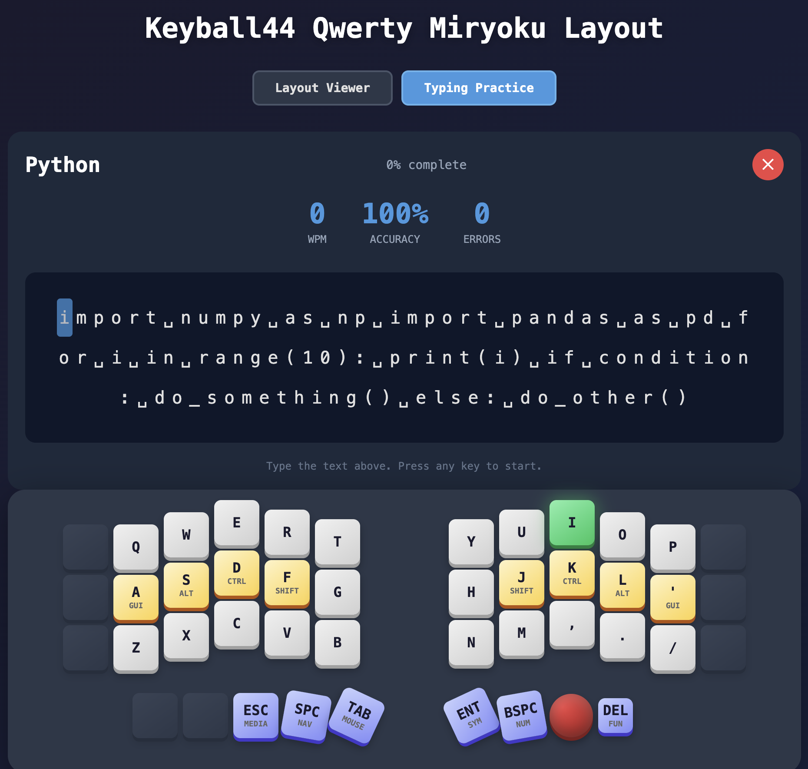
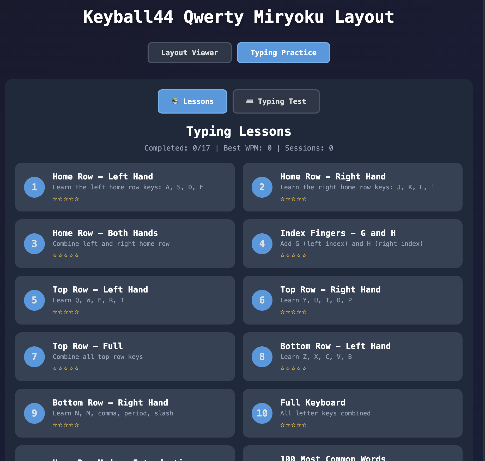
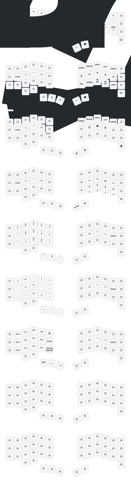

# Keyball44 ZMK Configuration

ZMK firmware configuration for the Keyball44 split keyboard with integrated trackball, featuring a **Miryoku-inspired layout** with home row mods and an interactive **typing trainer** web app.

## Typing Trainer

**[Launch Typing Trainer](https://pegre94.github.io/zmk-config-Keyball44/)**

An interactive web app to learn and practice typing on the Keyball44:
- **Layout Viewer** - Visual keyboard with real-time key press detection
- **Progressive Lessons** - Learn touch typing step by step 
- **Typing Tests** - Practice with quotes, code, vim commands, and more 
- **Layer Visualization** - See all 7 layers with key mappings

  
  

---

## Credits

**Special Thanks to:**
- **PCB:** [yangxing844](https://github.com/yangxing844)
- **Case:** [delock](https://github.com/delock)
- **Firmware:** [Amos698](https://github.com/Amos698)

---

## Keymap

---

## Layers (Miryoku)

| # | Name | Description |
|---|------|-------------|
| 0 | **BASE** | QWERTY with home row mods |
| 1 | **NAV** | Navigation (arrows, page up/down) |
| 2 | **MOUSE** | Mouse buttons |
| 3 | **MEDIA** | Media controls |
| 4 | **NUM** | Number pad |
| 5 | **SYM** | Symbols |
| 6 | **FUN** | Function keys (F1-F12) |
| 7 | **SCROLL** | Trackball scroll mode |
| 8 | **SNIPE** | Trackball precision mode |

---

## Layer Access (Thumb Cluster)

| Key | Tap | Hold |
|-----|-----|------|
| Left Inner | Escape | MEDIA |
| Left Middle | Space | NAV |
| Left Outer | Tab | SCROLL |
| Right Inner | Enter | SYM |
| Right Middle | Backspace | NUM |
| Right Outer (Trackball) | Delete | FUN |

---

## Custom Behaviors

### Layer-Tap (`&lt`)
- **Tapping term:** 240ms
- **Flavor:** balanced
- **Quick-tap:** 150ms

### Mod-Tap (`&mt`)
- **Tapping term:** 200ms
- **Flavor:** tap-preferred
- **Quick-tap:** 150ms

### Caps Word
Continues with `_` and `-` characters.

---

## Bluetooth Controls (SYM Layer)

| Key Position | Action |
|--------------|--------|
| A | Clear all pairings (`BT_CLR`) |
| S | Select profile 0 |
| D | Select profile 1 |
| F | Select profile 2 |

---

## Trackball Configuration

| Setting | Value |
|---------|-------|
| **CPI** | 1200 |
| **CPI Divider** | 4 |
| **Snipe CPI** | 400 |
| **Scroll Tick** | 32 |
| **Orientation** | 180° |
| **Polling Rate** | 125Hz |
| **Automouse Timeout** | 700ms |
| **Smart Algorithm** | Enabled |

---

## Hardware

- **Board:** nice!nano v2
- **Shields:** keyball44_left, keyball44_right
- **Sensor:** PMW3610 (trackball)
- **Display:** Enabled
- **ZMK Studio:** Enabled (no locking)

---

## Bluetooth Settings

| Setting | Value |
|---------|-------|
| TX Power | +8 dBm (max) |
| Connection Interval | 9 |
| Latency | 16 |
| Experimental Connection | Enabled |
| Split Battery Proxy | Enabled |

---

## Building

Firmware is built via GitHub Actions. Push to trigger a build, then download artifacts from the Actions tab.
